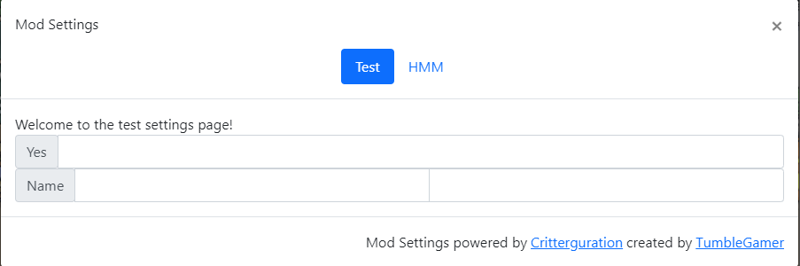

# Critterguration

## Install
```js
// @require      https://github.com/tumble1999/popper/raw/master/popper.js
// @require      https://github.com/tumble1999/critterguration/raw/master/critterguration.js
```

## Usage
```js
let settingContainer = Critterguration.registerSettingsMenu({ id: "test", name: "Test" });
	settingContainer.innerText = "Welcome to the test settings page!";

	settingContainer.createInput("Yes", "text", (value) => {
		console.log("You said", value);
	});
	

	let nameGroup = settingContainer.createInputRow("Name");
	nameGroup.createInput("FirstName", "text");
	nameGroup.createInput("Second Name", "text");
```