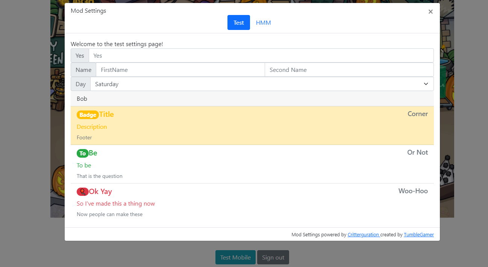

# Critterguration

## Install
```js
// @require      https://github.com/tumble1999/modial/raw/master/modial.js
// @require      https://github.com/SArpnt/ctrl-panel/raw/master/script.user.js
// @require      https://github.com/tumble1999/critterguration/raw/master/critterguration.user.js
```

## Usage
```js
//returns html elemet you can use append child to to add elements yourself
let settingContainer = Critterguration.registerSettingsMenu({ id: "test", name: "Test" });
settingContainer.innerText = "Welcome to the test settings page!";

	//returns html elemet representing the input elememt
	settingContainer.createInput("Yes", "text", (value) => {
		console.log("You said", value);
	});

//returns html element representing the select elememt
	settingContainer.createDropdown("Day",
	//options
		[
			{ value: "0", text: "Monday" },
			{ value: "1", text: "Teusday" },
			{ value: "2", text: "Wednesday" },
			{ value: "3", text: "Thursday" },
			{ value: "4", text: "Friday" },
			{ value: "5", text: "Saturday" },
			{ value: "6", text: "Sunday" }
		],
		//Should an option be selected
		value => value == new Date().getDay(),//Select the current day
		//What to do when a user selects an option
		value => {
			console.log("The day is", value.text);
		});
	
	//returns html element representing the div
	let nameGroup = settingContainer.createInputRow("Name");
	
	//returns html elemet representing the input elememt
	nameGroup.createInput("FirstName", "text");
	nameGroup.createInput("Second Name", "text");
```